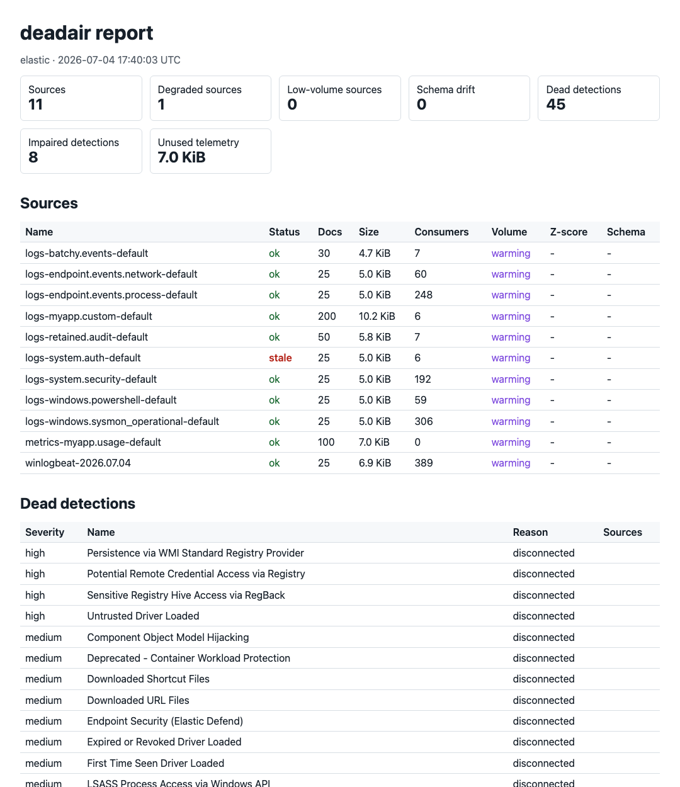

<p align="center">
  <picture>
    <source media="(prefers-color-scheme: dark)" srcset="docs/assets/banner-dark.svg">
    
  </picture>
</p>

<p align="center">
  <a href="https://github.com/Big-Comfy/deadair/actions/workflows/ci.yml"></a>
  <a href="https://github.com/Big-Comfy/deadair/releases"></a>
  
  <a href="LICENSE"></a>
</p>

**deadair finds the detection rules in your SIEM that are running blind.**

You usually find out a log source died when an investigation needs it: the index has been
quiet for three weeks, and every rule reading it has been returning clean, silent false
negatives the whole time. Rule-execution monitoring never flagged anything, because it checks
whether rules ran — not whether they had data to run against.

deadair checks the other half. It connects read-only to Elastic Security or OpenSearch
Security Analytics, builds the dependency graph between your rules and the indices they
query, and reports:

- **Dead** — enabled rules that cannot fire: patterns matching no index, or every matched
  source stale or empty. The winlogbeat that stopped shipping Friday night, surfaced Monday
  morning instead of mid-IR.
- **Impaired** — rules that fire with degraded vision: a 90-day lookback over an index ILM
  deletes at 30, `required_fields` the last integration upgrade renamed, or ingest lag wide
  enough that events land after their detection window already ran.
- **Unused** — telemetry you're paying to ingest that no enabled rule reads. Ingest budget
  with no coverage attached.

Every source comes with its blast radius: how many enabled rules go blind if it dies. Single
binary, no agents, nothing installed on the SIEM side.

[Example](#example) · [Get started](#get-started) · [Usage](#usage) · [In CI](#in-ci) ·
[Fleet](#fleet) · [Exporter](#exporter) · [Backends](#backends) · [Docs](#docs)

## Example

An Elastic 8.17 cluster with the prebuilt detection package installed (1,274 rules), about
500 of them enabled, and nine live data streams — scanned in 0.8 seconds:

<p align="center">
  
</p>

The 45 dead rules are enabled rules whose index patterns match nothing in the cluster — in
this lab, integrations that were never onboarded. The point is that the SIEM shows all 500 as
equally healthy: scheduled, executing, green in rule monitoring. Day one that gap is an
onboarding backlog; two years in, the same signal is the agent that died in March that nobody
noticed. Sample reports in every format are in [docs/examples](docs/examples/).

## Get started

Download a binary from the [releases page](../../releases) — macOS, Linux, and Windows,
amd64 and arm64 — or `go install github.com/Big-Comfy/deadair/cmd/deadair@latest`. Then:

```sh
deadair setup   # prints the least-privilege role, key command, and env exports
deadair check   # verifies the connection and each privilege individually
deadair scan    # first report
```

<p align="center">
  
</p>

## Usage

```sh
export DEADAIR_ES_URL=https://es.example.internal:9200
export DEADAIR_KIBANA_URL=https://kibana.example.internal:5601
export DEADAIR_API_KEY=<read-only key>

deadair scan                                   # terminal summary
deadair scan --json                            # full report
deadair scan --out r.json --html-out r.html   # files, created 0600
```

OpenSearch: `DEADAIR_BACKEND=opensearch`, `DEADAIR_OPENSEARCH_URL`, basic auth
([setup](docs/credentials/opensearch.md)).

Exit codes: `0` healthy, `1` findings, `2` scan failed.

| Flag | Purpose |
|---|---|
| `--max-stale 30m` | quiet period before a source counts as stale |
| `--include` / `--exclude` | scope the report listing; verdicts are unaffected |
| `--state-file s.json` | volume baselines: weekday/hour history, warmup, hysteresis |
| `--downtime-file d.json` | declared maintenance windows; suppresses findings inside them |
| `--schema` | field_caps drift between scans (requires `--state-file`) |
| `--redact` | stable digests instead of source/rule names |

The HTML report:

<p align="center">
  <a href="docs/examples/sample-report.html"></a>
</p>

## In CI

The exit codes gate pipelines: a pull request that ships a rule reading a dead index fails
the build.

```sh
deadair scan --rule new-rule.json      # evaluate a candidate rule; exit 1 if it can't see data here
deadair diff last-week.json today.json # exit 1 if something newly died or degraded
```

`--rule` takes the rule JSON or ndjson export from your detection-as-code repo and evaluates
it against the live environment without installing it; pre-existing findings don't affect its
exit code. `diff` compares two saved reports and fails only on regressions — the right gate
while a backlog is still being worked down. Both work on redacted reports, because digests
are stable.

<p align="center">
  
</p>

## Fleet

For estates with more than one SIEM — an MSSP client book, prod/staging pairs,
post-acquisition sprawl — `--fleet` scans every instance in one run and rolls up what
recurs. "Dead in 3 of 12 tenants" is one line in one report, not twelve consoles.

```sh
deadair check --fleet fleet.json         # verify every instance before reporting
deadair scan --fleet fleet.json          # scan every instance listed in fleet.json
deadair serve --fleet fleet.json         # per-instance metrics from one exporter
```

```json
{"instances": [
  {"name": "acme-prod", "backend": "elastic", "es_url": "https://...", "kibana_url": "https://...", "api_key_env": "ACME_KEY"},
  {"name": "beta-corp", "backend": "opensearch", "opensearch_url": "https://...", "username": "deadair", "password_env": "BETA_PW"}
]}
```

Secrets are referenced by env var or file, never written into the config. Instances scan
sequentially, one tenant's SIEM at a time; an unreachable tenant is reported and exits `2`
without hiding the others. With `--state-file`, baselines are kept per instance.

Every metric carries an `instance` label, and `--redact` digests tenant names along with
everything else, which keeps client-facing MSSP reports free of tenant identities.

A live scan across three tenants on two backends:

<p align="center">
  
</p>

For MSSP rollout details, including secret layout, redaction defaults, Alertmanager routing,
artifact retention, and fleet sizing, see [docs/mssp.md](docs/mssp.md).

## Exporter

`deadair serve` scans on an interval and exposes Prometheus metrics. Dashboard and alert rules
for Grafana/Alertmanager are in [contrib](contrib/). Scrapes read a cached snapshot; scrape
load never reaches the SIEM.

```sh
deadair serve --interval 5m   # binds 127.0.0.1:9317
```

## Backends

Two backends are supported today, and only these two. Support tiers mean:

| Tier | Meaning |
|---|---|
| Supported | backend code, least-privilege docs, live CI proof, rejected-write proof, and additive report compatibility |
| Preview | real backend proof exists, but field dogfooding is still pending |
| Experimental | parser/replay or early adapter work; no support claim |

| Backend | Versions | Tier | Evidence | MSSP status |
|---|---|---|---|---|
| Elastic Security | 8.x | Supported | CI-tested against live clusters on every push, least-privilege role proven with rejected writes | controlled pilot-ready |
| OpenSearch Security Analytics | 2.x | Supported | CI-tested against live clusters on every push, least-privilege role proven with rejected writes | controlled pilot-ready |

No preview or experimental backends ship today. Microsoft Sentinel is the first planned preview
target; Google SecOps and the rest are demand-ranked candidates. Splunk is permanently out of
scope. What a backend implementation must provide is documented in
[architecture.md](docs/architecture.md). If you run another SIEM and want deadair on it,
[open an issue](../../issues).

## Report handling

A deadair report maps detection blind spots. Defaults assume it could leak:

- Read-only by construction. The least-privilege roles in [docs/credentials](docs/credentials/)
  are verified in CI against live clusters, including rejected writes.
- Report and state files are written `0600`.
- Exporter binds loopback by default; metric labels contain source names, so use `--redact` or
  an authenticated scrape path beyond loopback.
- Secrets via environment or file, never argv. No phone-home, no usage telemetry.

## Docs

- [Usage guide](docs/usage.md) — every workflow, and what to do about each finding class.
- [Best practices](docs/best-practices.md) — rollout order, false-positive avoidance, fleets.
- [MSSP deployment guide](docs/mssp.md) — fleet secrets, redaction, routing, retention, sizing.
- [Architecture](docs/architecture.md) — the data model, API costs, security properties.

## License

Apache-2.0. If a commercial layer ever exists, everything in this repository stays Apache-2.0.
