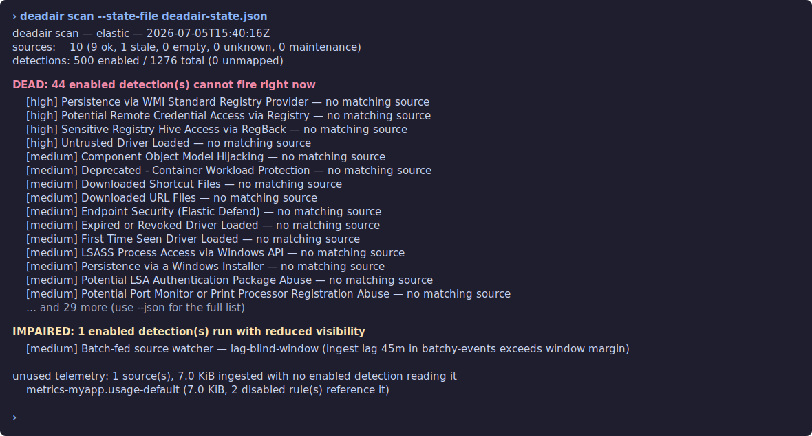

<p align="center">
  <picture>
    <source media="(prefers-color-scheme: dark)" srcset="docs/assets/banner-dark.svg">
    
  </picture>
</p>

<p align="center">
  <a href="https://github.com/Big-Comfy/deadair/actions/workflows/ci.yml"></a>
  <a href="https://github.com/Big-Comfy/deadair/releases"></a>
  
  <a href="LICENSE"></a>
</p>

**Open-source SIEM detection health**

Find enabled detections that are blind because their telemetry is missing, stale, late, or
schema-incompatible.

Runs locally. Read-only. No agent. No telemetry upload.

```sh
deadair demo
```

The embedded demo needs no SIEM, credentials, or Docker. It produces the same terminal, JSON, and
HTML findings as a live scan from deterministic synthetic evidence.

### What deadair proves

deadair verifies that a detection's observable telemetry prerequisites are present and healthy in
the environment being scanned.

### What it does not prove

deadair does not prove that rule logic is correct or that a simulated attack will produce an
alert. Pair it with static rule validation and end-to-end detection testing for those layers.

In deadair reports, a **rule pattern** is an index or data-stream expression configured on a
detection, such as `winlogbeat-*`. A **source** is a concrete index or data stream visible to the
deadair credential, such as `winlogbeat-2026.07` or
`logs-windows.sysmon_operational-default`. It is not the agent, connector, or upstream product.
deadair asks the backend to resolve rule inputs using its native index, alias, data-stream, and
selector semantics, then connects the result to the concrete sources it can assess.

Use it to answer three SOC questions:

- Which enabled detections have no matching index or data stream, or only stale or empty matched
  sources?
- Which detections still run, but with reduced visibility because fields drifted or events arrive
  after the rule lookback window?
- Which log sources are being ingested but no enabled detection reads them?

No agent. No SIEM-side install. No writes to the monitored cluster. Elastic Security and
OpenSearch Security Analytics are the only supported backends today.

[Try the demo](#get-started) | [Findings](#findings) | [CI gates](#ci-gates) |
[Fleet and MSSP use](#fleet-and-mssp-use) | [Exporter](#exporter) |
[Supported SIEMs](#supported-siems) | [Validation](#validation) | [Docs](#docs)

## Live lab example

This separate live lab scan uses Elastic with the prebuilt rule package installed, about 500
rules enabled, and only a few seeded data streams:

<p align="center">
  
</p>

The terminal view is a summary. The full JSON report records the patterns and matched sources used
to reach each verdict. One finding from this lab is:

| Evidence | Value |
|---|---|
| Enabled rule | `Persistence via WMI Standard Registry Provider` |
| Configured patterns | `logs-endpoint.events.registry-*`, `endgame-*` |
| Concrete sources matched | none |
| Finding | `no matching source` (`disconnected` in JSON) |
| Operational impact | the rule currently has no index or data stream to query |

That result is expected in this small lab because no Endpoint registry or Endgame source was seeded.
The same evidence can identify a regression in production. For example, a Windows rule still queries
`winlogbeat-*` after the SOC migrates events to
`logs-windows.sysmon_operational-*`. Once the old Winlogbeat indices age out, the rule remains enabled
but its configured pattern resolves to nothing. Depending on the backend and rule settings, execution may
produce an empty search or a missing-index warning; either way, that input is unavailable to the rule.

Treat first-run findings as an inventory review. In a new deployment, no-match findings are often
onboarding backlog or intentionally unsupported integrations. In an established environment, check
for renamed data streams, pattern changes, removed integrations, copied rules, and credential scope.

Sample terminal, JSON, and HTML reports are in [docs/examples](docs/examples/).

For the longer explanation behind the check — including native Elastic overlap, ingest-lag math, and
a reproducible simulation — read [Detections that run but can't see](https://big-comfy.github.io/deadair/).

## Get started

Download a binary from the [releases page](https://github.com/Big-Comfy/deadair/releases) for
macOS, Linux, or Windows (amd64 and arm64), or install from source:

```sh
go install github.com/Big-Comfy/deadair/cmd/deadair@latest
```

Then run:

```sh
deadair demo    # deterministic evaluation; no credentials or Docker

deadair setup   # print the least-privilege role and credential commands
deadair check   # verify the connection and required privileges
deadair scan    # produce the first report
```

<p align="center">
  
</p>

Elastic example:

```sh
export DEADAIR_ES_URL=https://es.example.internal:9200
export DEADAIR_KIBANA_URL=https://kibana.example.internal:5601
export DEADAIR_API_KEY=<read-only key>

deadair scan
deadair scan --json
deadair scan --out report.json --html-out report.html
```

OpenSearch example:

```sh
export DEADAIR_BACKEND=opensearch
export DEADAIR_OPENSEARCH_URL=https://opensearch.example.internal:9200
export DEADAIR_OPENSEARCH_USERNAME=deadair
export DEADAIR_OPENSEARCH_PASSWORD=<password>

deadair scan
```

Exit codes are stable: `0` means healthy, `1` means findings, and `2` means the scan failed.

## Findings

deadair separates rule dependency findings from source-health findings.

| Finding | Evidence and operational meaning | First check |
|---|---|---|
| no matching source (`disconnected` in JSON) | none of the rule's patterns resolved to a visible index or data stream, so the rule has no concrete source to query | inspect its patterns, expected integration, and credential scope |
| all matching sources stale or empty (`starved` in JSON) | every resolved source is stale or has zero documents, so none currently provides usable telemetry | inspect source age, document counts, and the ingest path |
| stale source | the source has documents but no event inside `--max-stale`; detections may be operating on old data | compare expected cadence, then check agent, connector, and pipeline health |
| empty source | the index or data stream exists with zero documents | confirm the integration, routing, and ingest pipeline |
| missing fields | best-effort rule-declared fields are absent from every matched source mapping checked with `field_caps` | compare rule metadata with the current parser and mapping |
| lag blind window | measured ingest lag exceeds the rule's lookback-minus-interval margin, so events can miss the search window | compare source lag with rule interval, lookback, and timestamp override |
| unused telemetry | the source has data and every enabled local input was assessed, but none resolves to it | confirm intentional collection, disabled rules, and coverage plans |

All findings are limited to the rules and sources visible to the configured credential. A narrowly
scoped role that cannot see an expected index can look the same as an absent index. Validate role
scope during the first scan.

To inspect the evidence behind the terminal summary:

```sh
deadair scan --json --out report.json
jq '.dead_detections[] | {name, reason, patterns, sources}' report.json
```

Useful flags:

| Flag | Use |
|---|---|
| `--max-stale 30m` | set the quiet-period threshold for stale sources |
| `--state-file state.json` | keep scan history for volume baselines and ingest-lag checks |
| `--schema` | track `field_caps` schema drift across scans; requires `--state-file` |
| `--downtime-file downtime.json` | suppress expected maintenance windows without hiding sources |
| `--redact` | replace tenant, rule, source, pattern, and field names with stable digests |

HTML output is built into `scan`. Open the checked-in
[sample HTML report](docs/examples/sample-report.html) to inspect the full layout and findings.

## CI gates

Use `scan --rule` in detection-as-code pull requests. It checks a candidate rule against the live
environment before the rule is installed:

```sh
deadair scan --rule new-rule.json
```

Use `diff` for scheduled regression checks while you still have an existing backlog:

```sh
deadair scan --json --out today.json
deadair diff yesterday.json today.json
```

`scan --rule` exits `1` for a dead or impaired candidate and `2` when the candidate cannot be
assessed safely; unrelated source degradation does not fail it. `diff` fails only for new dead,
impaired, or degraded findings. Both work on redacted reports because redaction is deterministic.

<p align="center">
  
</p>

## Fleet and MSSP use

`--fleet` scans more than one SIEM instance in one run. That covers MSSP client books, separate
prod/staging SIEMs, regional deployments, and post-acquisition sprawl.

```sh
deadair check --fleet fleet.json
deadair scan --fleet fleet.json
deadair serve --fleet fleet.json
```

Fleet config stores references to secrets, not the secret values:

```json
{"instances": [
  {
    "name": "acme-prod",
    "backend": "elastic",
    "es_url": "https://...",
    "kibana_url": "https://...",
    "api_key_env": "ACME_KEY"
  },
  {
    "name": "beta-corp",
    "backend": "opensearch",
    "opensearch_url": "https://...",
    "username": "deadair",
    "password_env": "BETA_PW"
  }
]}
```

Fleet scans are sequential so one deadair process does not fan out load across every customer SIEM
at once. One failed tenant is reported as failed and returns exit `2`; the successful tenants still
appear in the report. With `--state-file`, each tenant gets its own state file.

For client-facing reports or shared Prometheus, use `--redact`. Tenant names are treated as
sensitive too.

<p align="center">
  
</p>

Run the local MSSP lab when you want to exercise the operator path:

```sh
make mssp-lab
```

It boots throwaway Elastic and OpenSearch stacks, scans a five-instance fleet with working and
failing tenants, scrapes the exporter, and writes redacted artifacts under
`integration/mssp-lab-out/`.

<p align="center">
  
</p>

## Exporter

`deadair serve` runs scans on an interval and exposes Prometheus metrics. Scrapes read the cached
last scan, so Prometheus scrape volume does not hit the SIEM APIs.

```sh
deadair serve --interval 5m
```

By default it binds `127.0.0.1:9317`. Grafana and Alertmanager examples are in
[contrib](contrib/).

## Supported SIEMs

Only two backends are supported today. The trusted integration matrix covers the current and
previous major lines:

| Backend | Tested versions | Status | Evidence |
|---|---|---|---|
| Elastic Security | 8.19.19, 9.4.4 | supported | live matrix, least-privilege docs, rejected-write proof |
| OpenSearch Security Analytics | 2.19.6, 3.7.0 | supported | live matrix, least-privilege docs, rejected-write proof |

See the [backend support policy](docs/support-policy.md) for the meaning of tested, supported, and
best effort, plus the removal policy.

No preview or experimental backends ship in this release. Microsoft Sentinel is the first planned
preview target. Google SecOps and other SIEMs are demand-ranked candidates. Splunk is out of
scope.

Support status terms:

| Status | Meaning |
|---|---|
| supported | backend code, credential docs, live integration proof, rejected-write proof, and stable report compatibility |
| preview | real backend proof exists, but field dogfooding is not complete |
| experimental | parser or adapter work only; no support claim |

## Validation

The supported backend claims are based on live CI against real Elastic and OpenSearch containers,
least-privilege credential docs, rejected-write tests, and the Docker-backed MSSP lab. That proves
the backend APIs and operator workflow; it does not replace field dogfooding against production
source cadence, hosted SIEM edge cases, or large real fleets.

If you want to test deadair safely, start with [Validation and dogfooding](docs/validation.md).
Use `--redact` before sharing public results. Microsoft Sentinel operators can also use the
[Sentinel design-partner issue](https://github.com/Big-Comfy/deadair/issues/3).

## Report handling

Treat reports like sensitive SOC artifacts. They name blind detections, unused telemetry, source
names, rule names, and sometimes tenant names.

- Report, HTML, and state files are written `0600` on POSIX systems.
- Credentials can come from environment variables or files. Do not pass secrets in argv.
- `--redact` keeps reports useful for sharing while hiding names behind stable digests.
- The exporter binds loopback by default. Put it behind authenticated scraping if it leaves the
  host.
- deadair has no phone-home behavior and no usage telemetry.

## Docs

- [Usage guide](docs/usage.md) - report terminology, worked findings, triage, CI gates, stateful checks, and fleets.
- [Best practices](docs/best-practices.md) - rollout order, actionable alert context, and routing guidance.
- [Validation and dogfooding](docs/validation.md) - what is proven, what still needs field proof, and how to share safe results.
- [Write-up](https://big-comfy.github.io/deadair/) - why enabled rules can still lose telemetry.
- [MSSP deployment guide](docs/mssp.md) - fleet secrets, redaction, routing, retention, sizing.
- [Elastic credentials](docs/credentials/elastic.md) - least-privilege Elastic role and API key.
- [OpenSearch credentials](docs/credentials/opensearch.md) - least-privilege OpenSearch roles.
- [Architecture](docs/architecture.md) - data model, API usage, safety properties, limits.

## License

Apache-2.0. If a commercial layer ever exists, everything in this repository stays Apache-2.0.
